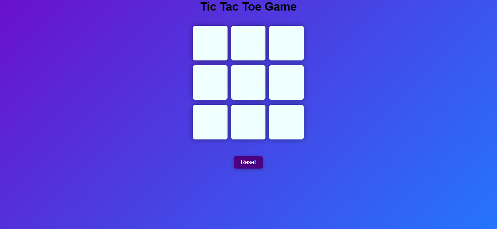

# 🎮 Tic Tac Toe Game

A responsive and interactive **Tic Tac Toe** game built using **HTML, CSS, and JavaScript**. Challenge your friend or yourself and enjoy the classic Xs and Os game in your browser!

---

## 🔗 Live Demo

[Click here to play the game](https://kaustubh-dalvi1001.github.io/Tic-Tac-Toe-Game/)

---

## 📸 Screenshot



---

## ✨ Features

- Two-player gameplay (X and O)
- Responsive layout for all devices
- Winner announcement and draw detection
- Option to reset or start a new game
- Smooth hover and click animations

---

## 🛠️ Technologies Used

- HTML5
- CSS3
- JavaScript (Vanilla)

---

## 🚀 How to Use

1. **Clone the repository**  
   ```bash
   git clone https://github.com/Kaustubh-Dalvi1001/Tic-Tac-Toe-JavaScript-Game.git
   ```

2. **Navigate to the project directory**  
   ```bash
   cd Tic-Tac-Toe-JavaScript-Game
   ```

3. **Open `index.html` in your browser**

---

## 📁 Folder Structure

```
Tic-Tac-Toe-JavaScript-Game/
│
├── images/
│  └── Tic_Tac_Toe_Game_Screenshot-1.png
├── index.html
├── tic.css
├── tic.js
└── README.md
```
## 👨‍💻 Author

Kaustubh Dalvi  
📫 GitHub Profile: https://github.com/Kaustubh-Dalvi1001

## 📬 Connect with Me

- [LinkedIn](https://www.linkedin.com/in/kaustubh-dalvi-0431662a8)  
- [GitHub](https://github.com/Kaustubh-Dalvi1001)  
- 📧 kaustubhdalvi1001@gmail.com

---

## ✅ Status

Project completed and deployed.

---

## 📝 License

This project is open source and available under the [MIT License](https://opensource.org/licenses/MIT).